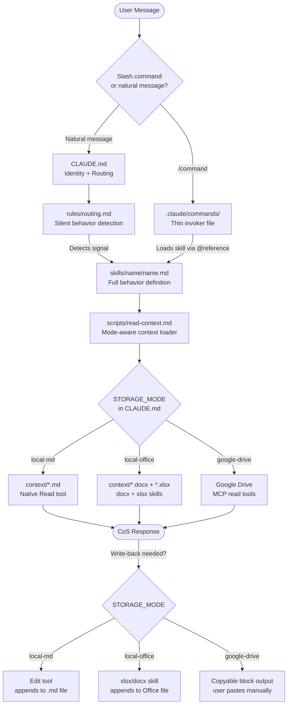
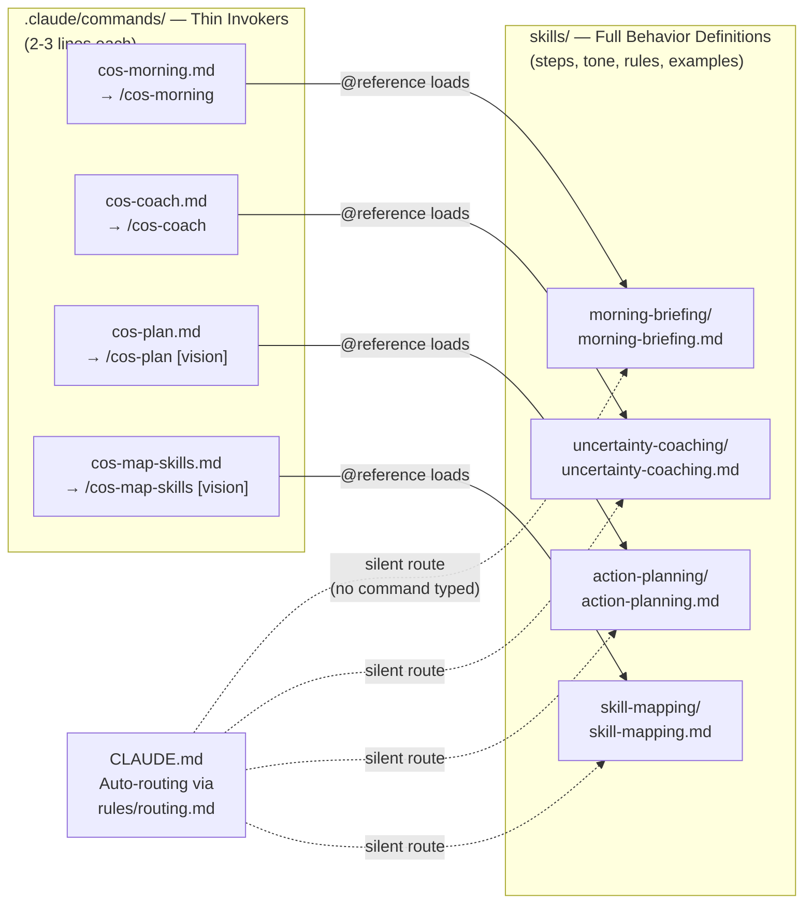
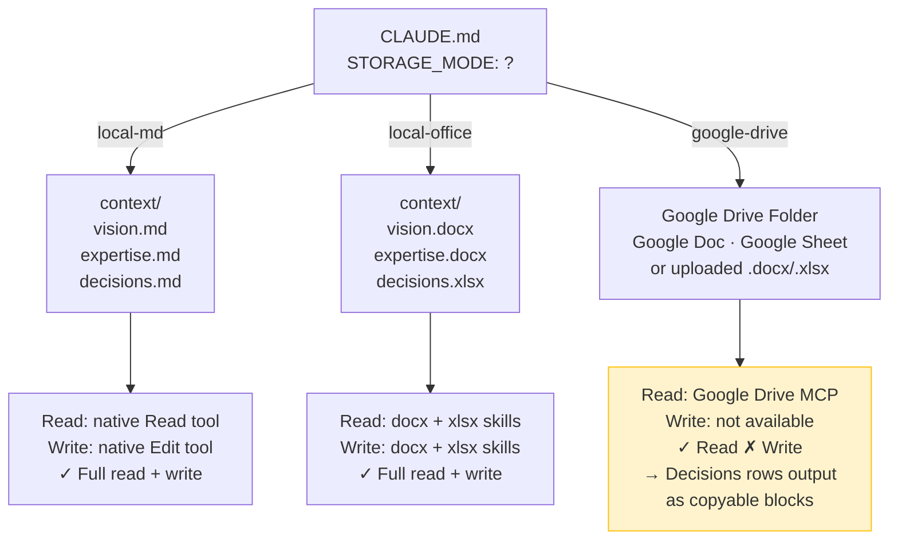

# Chief of Staff — Architecture Guide

This document explains how the Chief of Staff project is structured, how the pieces connect, and how to extend it. It is intended for students and builders who want to understand the design before they use or modify it.

---

## What this project is

A Chief of Staff is a conversational strategic adviser built on Claude Code. It reads three personal files — your vision, your expertise, and your past decisions — and uses them to give you grounded, specific, non-generic coaching and planning. Every behavior is a separate skill. Every skill can be invoked explicitly with a slash command, or activated silently by the CoS when it detects the right signal in the conversation.

---

## Folder Map

```
Chief Of Staff - Code/
│
├── CLAUDE.md                    ← Loaded on every conversation. Identity + storage config + routing.
├── architecture.md              ← You are here.
│
├── context/                     ← YOUR personal data. Edit these to personalize your CoS.
│   ├── vision.md / .docx        ← What you are building (present tense)
│   ├── expertise.md / .docx     ← What you bring to it
│   ├── decisions.md / .xlsx     ← Decisions you have made about your limiting thoughts
│   └── initiatives/             ← One folder per initiative
│       ├── _template/           ← Copy this to start a new initiative
│       └── [your-initiative]/   ← overview.md, actions.md, notes.md
│
└── .claude/                     ← ALL CoS behavior files live here
    ├── settings.json            ← Permissions (e.g. Google Drive MCP)
    ├── commands/                ← Slash commands — explicit entry points into each behavior
    │   ├── cos-morning.md       → /cos-morning
    │   ├── cos-questions.md     → /cos-questions
    │   ├── cos-map-skills.md    → /cos-map-skills [vision]
    │   ├── cos-plan.md          → /cos-plan [vision]
    │   ├── cos-coach.md         → /cos-coach
    │   ├── cos-network.md       → /cos-network [vision]
    │   ├── cos-metrics.md       → /cos-metrics [vision]
    │   └── cos-update-files.md  → /cos-update-files
    ├── skills/                  ← Full behavior definitions. One folder per behavior.
    │   ├── morning-briefing/
    │   ├── productive-questions/
    │   ├── skill-mapping/
    │   ├── action-planning/
    │   ├── uncertainty-coaching/
    │   ├── network-mapping/
    │   ├── metrics/
    │   └── file-update-detection/
    ├── rules/                   ← Behavioral rules. Referenced from CLAUDE.md.
    │   ├── core-rules.md
    │   ├── vision-frame.md
    │   └── routing.md
    └── scripts/                 ← Reusable prompt fragments. Referenced by skills and commands.
        ├── read-context.md      ← Mode-aware: reads vision + expertise + decisions
        └── decisions-row-template.md ← Output template for a new decisions row
```

---

## Diagram 1 — How a conversation flows

Every message takes one of two paths: the user sends a natural message and the CoS routes silently, or the user types a slash command which goes directly to the right behavior. Both paths end at the same place: a skill reads the user's context and responds.



---

## Diagram 2 — The command → skill separation

Commands and skills are two distinct layers. Commands are thin invokers — they know which behavior to run but contain no behavior logic. Skills are the authoritative definitions — they contain all the steps, tone guidance, and rules for a behavior. This separation means:

- Behavior logic lives in exactly one place
- Commands can pass arguments (`/plan Flintolabs`) without duplicating logic
- CLAUDE.md can reference skills directly for automatic routing, using the same skill files



---

## Diagram 3 — Storage modes

The user sets `STORAGE_MODE` once in CLAUDE.md. All three modes give full read capability. Only `local-md` and `local-office` support write-back — in `google-drive` mode, the Drive MCP has no update tool, so the CoS outputs copyable blocks for the user to paste manually.



---

## The context/ folder

This is the only folder you edit directly as a user. Everything else is system logic.

### context/vision.md (or .docx)
Your vision statements, written in present tense as if already achieved. One section per vision. The CoS reads this to understand what you are building and checks in on it at the start of every session.

### context/expertise.md (or .docx)
Your skills, background, and domain knowledge. The CoS reads this to build skill maps and action plans that are grounded in what you actually have — not generic advice.

### context/decisions.md (or .xlsx)
A table with three columns:

| Limiting Thought | Empowering Decision | Evidence |
|---|---|---|
| The doubt, in your words | The decision you made in response | Specific proof from your life |

The CoS reads this during uncertainty coaching to remind you of decisions you have already made. After coaching sessions, it writes a new row here automatically (or outputs a copyable block if you are in google-drive mode).

### context/initiatives/
One folder per initiative. Copy `_template/` to start a new one:

```
cp -r context/initiatives/_template/ context/initiatives/my-initiative/
```

Then fill in `overview.md`. The CoS saves action plans to `actions.md` and running notes to `notes.md` during sessions.

---

## How to add a new initiative

1. Copy `context/initiatives/_template/` and rename it
2. Open `overview.md` and fill in what the initiative is and its current status
3. Reference it in a session: `/plan [initiative name]` — the CoS will find it

---

## How to change storage mode

1. Open `CLAUDE.md`
2. Find the line `STORAGE_MODE: local-office` and change the value
3. Add the corresponding files to `context/` if you have not already:
   - `local-md`: create `vision.md`, `expertise.md`, `decisions.md`
   - `local-office`: create `vision.docx`, `expertise.docx`, `decisions.xlsx`
   - `google-drive`: paste your Drive folder link into the `DRIVE_FOLDER` line

---

## How to add a new behavior

1. Create `skills/[behavior-name]/[behavior-name].md` — full behavior definition
2. Create `.claude/commands/cos-[name].md` — 3-line invoker that `@reference`s the skill
3. Add a row to `rules/routing.md` — trigger signals → skill file path

That is it. No registration required. The new command becomes available as `/cos-[name]` immediately.
